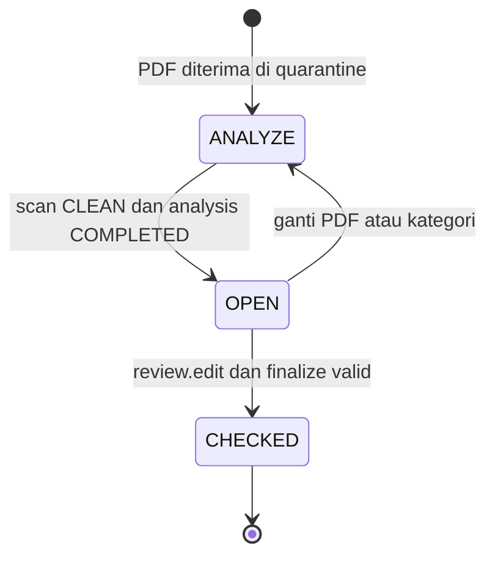

# FinLens — ERD Final

Versi 1.0 • Final baseline implementasi lokal • dimulai 5 September, difinalkan 6 September 2026.

Sumber kebenaran: FSD v1.0.0 tanggal 24 Agustus 2026 dan jawaban user/BA; instruksi terbaru user mengatasi catatan sebelumnya. Dokumen lama, repo, dan Figma adalah referensi turunan/teknis, bukan pengganti aturan bisnis. Status final berarti kontrak untuk coding berikutnya; bukan klaim aplikasi sudah dibuat, diuji, atau siap production.

Urutan baca: [ERD](01_ERD.md) → [Spec API](02_SPEC_API.md) → [Task](03_TASK.md) → [Arsitektur dan evaluasi](04_ARSITEKTUR.md). Hanya empat file ini menjadi paket final baru. Dokumen sumber tetap di lokasi semula.
## Acuan dan prioritas

| ID | Acuan | Pemakaian |
|---|---|---|
| S1 | [FSD asli](../../FSD_FinLens%20%2824082026%29.pdf), [ekstraksi FSD](../../FSD_FitLens.md) | Requirement dan field bisnis; Bab 3–14 |
| S2 | [Jawaban BA dan user](../../catatan.txt) | Lifecycle, terminal CHECKED, permission, role dependency, snapshot anomaly, scope |
| S3 | [Keputusan sebelumnya](../../output/discovery/discovery_questions.md), [context](../../project_context.md) | BA-001–BA-024; baseline v0.4 berlaku sampai user mengubahnya |
| S4 | Instruksi user 5 September 2026 di task ini | Empat dokumen final di folder baru; Login siap develop; coding setelah perintah berikutnya |
| R1 | [Repo Python](../../reference/finlens-be), [repo FE prototype](../../reference/finlens-fe) | Referensi logic AI dan integrasi; kontrak prototype tidak diadopsi otomatis |
| R2 | [Express template](../../reference/template%20js/express-js-template-development), [Next.js template](../../reference/template%20js/nextjs-development) | Struktur kerja lokal yang tersedia; repo bernama seva-agency-cms tidak ditemukan di folder |
| R3 | [Figma FinLens](https://www.figma.com/design/HSkVVcOU5xQOgjR5vQ2AUZ/FinLens?node-id=4-45916) | Visual Login siap develop menurut user; readiness modul lain tidak diasumsikan |

S2 memuat material konfigurasi sensitif. Referensikan keputusan bisnisnya saja; jangan menyalin isinya secara utuh ke repository, prompt, log, atau paket distribusi.
## Keputusan model dan invariant fisik

1. Semua tabel tenant memiliki `tenant_id NOT NULL`; FK komposit `(tenant_id, id)` mencegah record lintas tenant. Katalog permission/severity dan master tenant adalah global. Actor audit boleh null untuk proses sistem; actor history disimpan sebagai snapshot agar nama yang berubah tidak mengubah histori.
2. `mst_role.platform_managed` hanya diatur seed/operator provisioning. Role ini menampung permission platform `tenant.*`; API tenant tidak dapat membuat, mengedit, menghapus, menonaktifkan, atau menugaskan role platform. Nama role tidak memberi hak apa pun. Global master tenant tidak memberikan akses otomatis ke dokumen tenant lain. Pengecualian FSD 5.3: endpoint platform khusus membuat user pada tenant target yang tervalidasi; draft credential menyimpan actor_tenant_id terpisah dari tenant_id target. User/session biasa tetap satu tenant.
3. Nama unik dinormalisasi `trim + lowercase`. Versi final memilih nama tetap reserved setelah soft delete (constraint unik tanpa `deleted_at`); ini konsisten dengan FSD “sudah pernah terdaftar”. Email juga unik global dan immutable. NULL pada index lama `(tenant_id,name,deleted_at)` tidak melindungi dua nama aktif di PostgreSQL.
4. Status master dan API memakai `ACTIVE|NON_ACTIVE`, permission memakai titik `resource.action`, dan `versionNo` API memetakan `version_no` DB mulai 1. CHECK fisik diperlukan untuk enum, `version_no>=1`, `attempt_count BETWEEN 0 AND 3`, confidence/similarity 0–1, fraud score 0–100, dan PDF `size_bytes<=20971520`, `page_count BETWEEN 1 AND 100` sesudah validasi.
5. `trn_document` → current version/analysis harus menunjuk ke **dokumen yang sama**, bukan cukup tenant sama. Migration membuat FK tambahan `(tenant_id,document_id,current_version_id)` ke version `(tenant_id,document_id,document_version_id)` dan dua FK analisis sejenis. Tambahkan UNIQUE target komposit. FK pointer dibuat DEFERRABLE INITIALLY DEFERRED lewat SQL migration agar insert dokumen/version satu transaksi tidak buntu. Pointer versi wajib ada saat commit. DBML di bawah menunjukkan hubungan tenant; aturan satu dokumen ini juga wajib dalam DDL.
6. CHECKED memerlukan checked actor/time/analysis, current analysis COMPLETED untuk current version, active_flag Y, dan checked_analysis_id=current_analysis_id. Trigger menolak UPDATE/DELETE baris CHECKED, perubahan versi PDF, hasil, findings, similarity, dan snapshot yang sudah selesai; runtime DB role tidak diberi physical DELETE. Worker tidak boleh menulis lifecycle bisnis langsung.
7. Hanya OPEN boleh rename, ganti kategori/PDF, toggle, soft delete. Nama saja tidak memicu AI; perubahan kategori (mengubah skema analisis FSD Bab 8) atau PDF membuat analysis baru dan kembali ANALYZE. Kategori snapshot dipertahankan meskipun nama/status master berubah. `current_analysis_id` menunjuk run terbaru termasuk QUEUED/FAILED; histori sukses tetap tersimpan.
8. `trn_ai_anomaly_snapshot` dibuat atomik saat job dibuat, mencakup seluruh anomaly aktif, termasuk rule yang kelak tidak menghasilkan finding. Delete anomaly memeriksa snapshot dan finding aktif/historis; pemeriksaan hanya finding pada model lama tidak cukup. Semua operasi perubahan konfigurasi/snapshot memakai lock tenant terurut sehingga snapshot tidak setengah versi.
9. Role tidak boleh dihapus/nonaktif jika **ada user yang masih merujuknya**, termasuk nonaktif/soft-deleted. Category tidak boleh dihapus jika ada dokumen yang merujuknya. Guard dan perubahan/assignment dilaksanakan dengan parent-row lock yang sama untuk mencegah race.
10. Login menyerialkan pembuatan session pada row user (bukan hanya row session yang mungkin kosong), membersihkan yang idle/expired, lalu mencabut sesi tertua bila sudah lima. Refresh rotate mengunci token dan session, menandai used, lalu insert generasi berikutnya. Replay token used mencabut seluruh session family. Semua request mengecek session durable, user/role/tenant aktif dan permissions terbaru; pencabutan tidak hanya terhadap latest access_jti.
11. MFA state TOTP/recovery tetap milik provider. `trn_auth_context` hanya konteks otorisasi sementara, hash token dan tujuan; tidak menyimpan OTP, setup key atau recovery code. Setelah verifikasi MFA, temporary password menghasilkan konteks CHANGE_PASSWORD, belum full session; credential version dan consumed flag menutup replay.
12. Outbox dicatat bersama business mutation dan audit. Inbox unik per consumer/event serta notification source_event_id mencegah duplikasi at-least-once. Idempotency mencatat actor, operasi termasuk ID target, digest payload/file dan response aman. Row tidak dipurge Phase 1; request ulang dengan key sama/payload beda ditolak.
13. `trn_email_delivery` hanya metadata; plaintext password/reset token tidak masuk DB/outbox. Initial send dan retry dalam proses dapat memakai rahasia di memory. Setelah restart, retry menghasilkan credential/token baru dan mencabut versi sebelumnya; email terbaru yang berlaku. Simpan digest dan versi sebelum mengirim. Pengiriman email memiliki kemungkinan duplicate/ambiguous delivery, bukan exactly once.
14. `trn_credential_draft` mendukung field Generate/Re-Generate FSD Bab 5: password ditampilkan satu kali pada form admin, draft hash terikat actor/tenant selama 5 menit; submit membawa draft token dan password write-only untuk dicocokkan. Jangan mencatat credential di idempotency/audit. Re-generate membatalkan draft sebelumnya; delivery retry dapat mengganti credential seperti poin 13.
15. Audit hash chain diserialkan per tenant dengan transaction advisory lock, hash event kanonis plus previous_hash, append-only. Tidak ada physical purge Phase 1. Unknown-user authentication failure masuk security log teredaksi tanpa mengarang tenant; kejadian yang tenantnya diketahui dicatat pada tenant itu.

## Siklus status



Processing terpisah: QUEUED → PROCESSING → COMPLETED; timeout/error transient → QUEUED dengan backoff 30 lalu 120 detik; setelah attempt ketiga → FAILED + DLQ. Scan PENDING/CLEAN/INFECTED/ERROR tersimpan di version; scan belum CLEAN tidak boleh membuka bytes ke AI atau client. Scan terminal gagal: ANALYZE/FAILED tanpa retry AI. Retry Ops yang eksplisit membuat run baru, tidak menulis ulang hasil final.

## Kamus dan hubungan lengkap

DBML berikut adalah model lengkap yang dapat disalin ke dbdiagram. `uuid` adalah identitas internal; nilainya dibuat server. Waktu UTC `timestamptz`. Semua `created_at` diisi waktu transaksi. Audit IDs ditetapkan server; `created_by/updated_by` tidak menerima input client. Setiap field di bawah mempertahankan tipe, nullability, default dan index; constraint lintas-row serta trigger mengikuti daftar invariant di atas.

```dbml
Project FinLens_Phase1_Final {
  database_type: 'PostgreSQL'
  Note: 'Final desired-state PostgreSQL model; Prisma/SQL migrations are implementation work.'
}

Table mst_tenant {
  tenant_id uuid [pk]
  tenant_name varchar(100) [not null]
  normalized_name varchar(100) [not null, unique]
  status varchar(12) [not null, default: 'ACTIVE', note: 'ACTIVE|NON_ACTIVE']
  version_no int [not null, default: 1]
  created_at timestamptz [not null]
  created_by uuid
  updated_at timestamptz
  updated_by uuid
  deleted_at timestamptz

  Indexes {
    (status, deleted_at)
    created_at
  }
}

Table mst_role {
  role_id uuid [pk]
  tenant_id uuid [not null]
  role_name varchar(100) [not null]
  normalized_name varchar(100) [not null]
  status varchar(12) [not null, default: 'ACTIVE']
  platform_managed boolean [not null, default: false, note: 'Seed-only; cannot be changed by tenant role APIs']
  permissions_version int [not null, default: 1]
  version_no int [not null, default: 1]
  created_at timestamptz [not null]
  created_by uuid [not null]
  updated_at timestamptz
  updated_by uuid
  deleted_at timestamptz

  Indexes {
    (tenant_id, role_id) [unique]
    (tenant_id, normalized_name) [unique]
    (tenant_id, status, created_at)
  }
}

Table ref_permission {
  permission_code varchar(100) [pk, note: 'resource.action']
  menu_code varchar(50) [not null]
  action_code varchar(30) [not null]
  permission_label varchar(100) [not null]
  super_user_only_flag char(1) [not null, default: 'N']
  active_flag char(1) [not null, default: 'Y']

  Indexes {
    (menu_code, action_code) [unique]
  }
}

Table mst_role_permission {
  role_permission_id uuid [pk]
  tenant_id uuid [not null]
  role_id uuid [not null]
  permission_code varchar(100) [not null]
  allowed_flag char(1) [not null, default: 'Y']
  created_at timestamptz [not null]
  created_by uuid [not null]

  Indexes {
    (tenant_id, role_permission_id) [unique]
    (role_id, permission_code) [unique]
    (tenant_id, permission_code)
  }
}

Table mst_user {
  user_id uuid [pk]
  tenant_id uuid [not null]
  role_id uuid [not null]
  full_name varchar(100) [not null]
  email varchar(100) [not null, unique]
  password_hash varchar(255) [not null]
  must_change_password boolean [not null, default: true]
  temporary_password_expires_at timestamptz
  status varchar(12) [not null, default: 'ACTIVE']
  failed_login_count int [not null, default: 0]
  locked_until timestamptz
  credential_version int [not null, default: 1]
  temporary_password_used_at timestamptz
  last_login_at timestamptz
  version_no int [not null, default: 1]
  created_at timestamptz [not null]
  created_by uuid [not null]
  updated_at timestamptz
  updated_by uuid
  deleted_at timestamptz

  Indexes {
    (tenant_id, user_id) [unique]
    (tenant_id, full_name)
    (tenant_id, role_id, status)
    locked_until
  }
}

Table trn_user_session {
  session_id uuid [pk]
  tenant_id uuid [not null]
  user_id uuid [not null]
  access_jti varchar(100) [not null, note: 'Latest JTI only; session revocation invalidates ALL JTIs']
  authenticated_at timestamptz [not null]
  device_name varchar(100)
  operating_system varchar(100)
  browser_info varchar(255)
  ip_address varchar(45)
  last_activity_at timestamptz [not null]
  expires_at timestamptz [not null]
  revoked_at timestamptz
  revoked_reason varchar(100)
  created_at timestamptz [not null]

  Indexes {
    (tenant_id, session_id) [unique]
    (user_id, revoked_at, expires_at)
    (tenant_id, last_activity_at)
  }
}

Table trn_password_reset {
  reset_id uuid [pk]
  tenant_id uuid [not null]
  user_id uuid [not null]
  token_hash varchar(255) [not null, unique]
  expires_at timestamptz [not null]
  used_at timestamptz
  requested_ip varchar(45)
  created_at timestamptz [not null]

  Indexes {
    (tenant_id, reset_id) [unique]
    (user_id, created_at)
    (expires_at, used_at)
  }
}

Table ref_severity_level {
  severity_code varchar(20) [pk]
  severity_rank int [not null, unique]
  display_name varchar(30) [not null]
  description varchar(500)
  active_flag char(1) [not null, default: 'Y']
}

Table mst_anomaly {
  anomaly_id uuid [pk]
  tenant_id uuid [not null]
  anomaly_detail varchar(255) [not null]
  normalized_detail varchar(255) [not null]
  severity_code varchar(20) [not null]
  status varchar(12) [not null, default: 'ACTIVE']
  version_no int [not null, default: 1]
  created_at timestamptz [not null]
  created_by uuid [not null]
  updated_at timestamptz
  updated_by uuid
  deleted_at timestamptz

  Indexes {
    (tenant_id, anomaly_id) [unique]
    (tenant_id, normalized_detail) [unique]
    (tenant_id, severity_code, status)
  }
}

Table mst_file_category {
  category_id uuid [pk]
  tenant_id uuid [not null]
  category_name varchar(100) [not null]
  normalized_name varchar(100) [not null]
  status varchar(12) [not null, default: 'ACTIVE']
  version_no int [not null, default: 1]
  created_at timestamptz [not null]
  created_by uuid [not null]
  updated_at timestamptz [not null]
  updated_by uuid [not null]
  deleted_at timestamptz

  Indexes {
    (tenant_id, category_id) [unique]
    (tenant_id, normalized_name) [unique]
    (tenant_id, status, created_at)
  }
}

Table trn_document {
  document_id uuid [pk]
  tenant_id uuid [not null]
  category_id uuid [not null]
  document_name varchar(100) [not null]
  normalized_name varchar(100) [not null]
  document_number varchar(255)
  document_status varchar(12) [not null, default: 'ANALYZE', note: 'ANALYZE|OPEN|CHECKED; CHECKED terminal']
  active_flag char(1) [not null, default: 'Y']
  current_version_id uuid [not null]
  current_analysis_id uuid
  checked_analysis_id uuid
  checked_comment varchar(2000)
  checked_at timestamptz
  checked_by uuid
  version_no int [not null, default: 1]
  created_at timestamptz [not null]
  created_by uuid [not null]
  updated_at timestamptz [not null]
  updated_by uuid [not null]
  deleted_at timestamptz

  Indexes {
    (tenant_id, document_id) [unique]
    (tenant_id, normalized_name) [unique]
    (tenant_id, document_status, created_at)
    (tenant_id, active_flag, created_at)
    (tenant_id, document_number, created_at)
  }
}

Table trn_document_version {
  document_version_id uuid [pk]
  tenant_id uuid [not null]
  document_id uuid [not null]
  version_number int [not null]
  storage_key varchar(500) [not null, unique]
  original_filename varchar(255) [not null]
  content_type varchar(100) [not null]
  size_bytes bigint [not null]
  page_count int
  sha256_checksum char(64) [not null]
  scan_attempt_count int [not null, default: 0]
  scan_lease_token_hash char(64)
  scan_lease_expires_at timestamptz
  scan_next_attempt_at timestamptz
  malware_scan_status varchar(20) [not null, default: 'PENDING']
  uploaded_at timestamptz [not null]
  uploaded_by uuid [not null]

  Indexes {
    (tenant_id, document_version_id) [unique]
    (document_id, version_number) [unique]
    (tenant_id, sha256_checksum)
  }
}

Table trn_ai_analysis {
  analysis_id uuid [pk]
  tenant_id uuid [not null]
  document_id uuid [not null]
  document_version_id uuid [not null]
  processing_status varchar(20) [not null, default: 'QUEUED']
  category_snapshot jsonb [not null]
  configuration_hash char(64) [not null]
  candidate_scope_snapshot jsonb [not null]
  model_version varchar(100) [not null]
  rule_version varchar(100) [not null]
  extracted_document_number varchar(255)
  engine_policy_version varchar(100) [not null, default: 'engine-policy-v1']
  prompt_version varchar(100) [not null]
  similarity_policy_version varchar(100) [not null, default: 'historical-similarity-v1']
  fraud_score decimal(5,2)
  fraud_level_code varchar(20)
  result_hash char(64)
  raw_result_payload jsonb
  attempt_count int [not null, default: 0]
  lease_token_hash char(64)
  lease_expires_at timestamptz
  next_attempt_at timestamptz
  started_at timestamptz
  completed_at timestamptz
  failure_code varchar(100)
  failure_message varchar(500)
  created_at timestamptz [not null]

  Indexes {
    (tenant_id, analysis_id) [unique]
    (tenant_id, document_id, created_at)
    (processing_status, created_at)
    (tenant_id, extracted_document_number)
  }
}

Table trn_ai_finding {
  finding_id uuid [pk]
  tenant_id uuid [not null]
  analysis_id uuid [not null]
  anomaly_id uuid
  anomaly_detail_snapshot varchar(255) [not null]
  severity_code varchar(20) [not null]
  confidence decimal(5,4)
  page_number int
  evidence_text varchar(2000)
  evidence_payload jsonb
  created_at timestamptz [not null]

  Indexes {
    (tenant_id, finding_id) [unique]
    (analysis_id, severity_code)
    (tenant_id, anomaly_id)
  }
}

Table trn_similarity_match {
  similarity_match_id uuid [pk]
  tenant_id uuid [not null]
  analysis_id uuid [not null]
  matched_document_id uuid [not null]
  matched_version_id uuid [not null]
  match_type varchar(50) [not null]
  similarity_score decimal(5,4)
  match_severity_code varchar(20) [not null]
  match_rank int [not null]
  algorithm_version varchar(100) [not null]
  signal_payload jsonb [not null]
  explanation_payload jsonb
  created_at timestamptz [not null]

  Indexes {
    (tenant_id, similarity_match_id) [unique]
    (analysis_id, match_rank) [unique]
    (tenant_id, matched_document_id)
  }
}

Table trn_notification {
  notification_id uuid [pk]
  tenant_id uuid [not null]
  source_event_id uuid [not null, unique]
  notification_type varchar(50) [not null]
  document_id uuid
  actor_user_id uuid
  title varchar(150) [not null]
  message varchar(500) [not null]
  created_at timestamptz [not null]

  Indexes {
    (tenant_id, notification_id) [unique]
    (tenant_id, created_at)
  }
}

Table trn_notification_recipient {
  notification_recipient_id uuid [pk]
  tenant_id uuid [not null]
  notification_id uuid [not null]
  recipient_user_id uuid [not null]
  read_at timestamptz
  created_at timestamptz [not null]

  Indexes {
    (tenant_id, notification_recipient_id) [unique]
    (notification_id, recipient_user_id) [unique]
    (recipient_user_id, read_at, created_at)
  }
}

Table trn_audit_log {
  event_id uuid [pk]
  tenant_id uuid [not null]
  actor_user_id uuid
  actor_name_snapshot varchar(100)
  actor_role_name_snapshot varchar(100)
  target_name_snapshot varchar(255)
  actor_role_id uuid
  session_id uuid
  action_type varchar(50) [not null]
  target_module varchar(50) [not null]
  target_record_id varchar(100)
  result varchar(20) [not null]
  before_payload jsonb [note: 'Redacted before persistence']
  after_payload jsonb [note: 'Redacted before persistence']
  ip_address varchar(45)
  user_agent varchar(500)
  request_trace_id varchar(100) [not null]
  previous_hash char(64)
  event_hash char(64) [not null]
  occurred_at timestamptz [not null]

  Indexes {
    (tenant_id, event_id) [unique]
    (tenant_id, occurred_at, event_id)
    (tenant_id, actor_user_id, occurred_at)
    request_trace_id
  }
}

Table trn_outbox_event {
  outbox_event_id uuid [pk]
  tenant_id uuid [not null]
  aggregate_type varchar(50) [not null]
  aggregate_id uuid [not null]
  event_type varchar(100) [not null]
  payload jsonb [not null]
  attempt_count int [not null, default: 0]
  available_at timestamptz [not null]
  published_at timestamptz
  last_error varchar(500)
  created_at timestamptz [not null]

  Indexes {
    (tenant_id, outbox_event_id) [unique]
    (published_at, available_at)
    (tenant_id, aggregate_type, aggregate_id)
  }
}

Table trn_refresh_token {
  refresh_token_id uuid [pk]
  tenant_id uuid [not null]
  session_id uuid [not null]
  token_hash char(64) [not null, unique]
  generation int [not null]
  issued_at timestamptz [not null]
  expires_at timestamptz [not null]
  used_at timestamptz
  revoked_at timestamptz
  Indexes {
    (tenant_id, refresh_token_id) [unique]
    (tenant_id, session_id, generation) [unique]
  }
}

Table trn_auth_context {
  context_id uuid [pk]
  tenant_id uuid [not null]
  user_id uuid [not null]
  token_hash char(64) [not null, unique]
  purpose varchar(30) [not null, note: 'ENROLL|VERIFY|CHANGE_PASSWORD']
  credential_version int [not null]
  visitor_id varchar(255) [not null]
  is_private boolean [not null]
  mfa_verified_at timestamptz
  expires_at timestamptz [not null]
  consumed_at timestamptz
  created_at timestamptz [not null]
  Indexes {
    (tenant_id, context_id) [unique]
    (tenant_id, user_id, expires_at)
  }
}

Table trn_ai_anomaly_snapshot {
  snapshot_id uuid [pk]
  tenant_id uuid [not null]
  analysis_id uuid [not null]
  anomaly_id uuid [not null]
  anomaly_version int [not null]
  anomaly_detail varchar(255) [not null]
  severity_code varchar(20) [not null]
  created_at timestamptz [not null]
  Indexes {
    (tenant_id, snapshot_id) [unique]
    (tenant_id, analysis_id, anomaly_id) [unique]
  }
}

Table trn_idempotency {
  idempotency_id uuid [pk]
  tenant_id uuid [not null]
  actor_user_id uuid [not null]
  operation_key varchar(255) [not null]
  key_hash char(64) [not null]
  request_hash char(64) [not null]
  state varchar(20) [not null, note: 'IN_PROGRESS|COMPLETED']
  resource_id uuid
  http_status int
  response_payload jsonb [note: 'Safe DTO only; no auth tokens or signed URL']
  lease_expires_at timestamptz [not null]
  created_at timestamptz [not null]
  completed_at timestamptz
  Indexes {
    (tenant_id, idempotency_id) [unique]
    (tenant_id, actor_user_id, operation_key, key_hash) [unique]
  }
}

Table trn_inbox_event {
  inbox_id uuid [pk]
  tenant_id uuid [not null]
  consumer_name varchar(100) [not null]
  source_event_id uuid [not null]
  processed_at timestamptz [not null]
  Indexes {
    (tenant_id, inbox_id) [unique]
    (tenant_id, consumer_name, source_event_id) [unique]
  }
}

Table trn_email_delivery {
  delivery_id uuid [pk]
  tenant_id uuid [not null]
  user_id uuid [not null]
  event_id uuid [not null, unique]
  template_code varchar(50) [not null]
  credential_version int
  delivery_status varchar(20) [not null, note: 'QUEUED|SENDING|SENT|FAILED']
  attempt_count int [not null, default: 0]
  available_at timestamptz [not null]
  sent_at timestamptz
  last_error_code varchar(100)
  created_at timestamptz [not null]
  Indexes {
    (tenant_id, delivery_id) [unique]
    (tenant_id, user_id, created_at)
  }
}

Table trn_credential_draft {
  draft_id uuid [pk]
  tenant_id uuid [not null]
  actor_tenant_id uuid [not null, note: 'Actor home tenant; target tenant may differ only for authorized platform provisioning']
  actor_user_id uuid [not null]
  token_hash char(64) [not null, unique]
  password_hash varchar(255) [not null]
  expires_at timestamptz [not null]
  consumed_at timestamptz
  created_at timestamptz [not null]
  Indexes {
    (tenant_id, draft_id) [unique]
    (tenant_id, actor_user_id, expires_at)
  }
}

Ref: mst_role.tenant_id > mst_tenant.tenant_id
Ref: mst_role_permission.tenant_id > mst_tenant.tenant_id
Ref: mst_role_permission.(tenant_id, role_id) > mst_role.(tenant_id, role_id)
Ref: mst_role_permission.permission_code > ref_permission.permission_code
Ref: mst_user.tenant_id > mst_tenant.tenant_id
Ref: mst_user.(tenant_id, role_id) > mst_role.(tenant_id, role_id)
Ref: trn_user_session.tenant_id > mst_tenant.tenant_id
Ref: trn_user_session.(tenant_id, user_id) > mst_user.(tenant_id, user_id)
Ref: trn_password_reset.tenant_id > mst_tenant.tenant_id
Ref: trn_password_reset.(tenant_id, user_id) > mst_user.(tenant_id, user_id)
Ref: mst_anomaly.tenant_id > mst_tenant.tenant_id
Ref: mst_anomaly.severity_code > ref_severity_level.severity_code
Ref: mst_file_category.tenant_id > mst_tenant.tenant_id
Ref: trn_document.tenant_id > mst_tenant.tenant_id
Ref: trn_document.(tenant_id, category_id) > mst_file_category.(tenant_id, category_id)
Ref: trn_document.(tenant_id, checked_by) > mst_user.(tenant_id, user_id)
Ref: trn_document.(tenant_id, current_version_id) > trn_document_version.(tenant_id, document_version_id)
Ref: trn_document.(tenant_id, current_analysis_id) > trn_ai_analysis.(tenant_id, analysis_id)
Ref: trn_document.(tenant_id, checked_analysis_id) > trn_ai_analysis.(tenant_id, analysis_id)
Ref: trn_document_version.tenant_id > mst_tenant.tenant_id
Ref: trn_document_version.(tenant_id, document_id) > trn_document.(tenant_id, document_id)
Ref: trn_document_version.(tenant_id, uploaded_by) > mst_user.(tenant_id, user_id)
Ref: trn_ai_analysis.tenant_id > mst_tenant.tenant_id
Ref: trn_ai_analysis.(tenant_id, document_id) > trn_document.(tenant_id, document_id)
Ref: trn_ai_analysis.(tenant_id, document_version_id) > trn_document_version.(tenant_id, document_version_id)
Ref: trn_ai_analysis.fraud_level_code > ref_severity_level.severity_code
Ref: trn_ai_finding.tenant_id > mst_tenant.tenant_id
Ref: trn_ai_finding.(tenant_id, analysis_id) > trn_ai_analysis.(tenant_id, analysis_id)
Ref: trn_ai_finding.(tenant_id, anomaly_id) > mst_anomaly.(tenant_id, anomaly_id)
Ref: trn_ai_finding.severity_code > ref_severity_level.severity_code
Ref: trn_similarity_match.tenant_id > mst_tenant.tenant_id
Ref: trn_similarity_match.(tenant_id, analysis_id) > trn_ai_analysis.(tenant_id, analysis_id)
Ref: trn_similarity_match.(tenant_id, matched_document_id) > trn_document.(tenant_id, document_id)
Ref: trn_similarity_match.(tenant_id, matched_version_id) > trn_document_version.(tenant_id, document_version_id)
Ref: trn_similarity_match.match_severity_code > ref_severity_level.severity_code
Ref: trn_notification.tenant_id > mst_tenant.tenant_id
Ref: trn_notification.(tenant_id, document_id) > trn_document.(tenant_id, document_id)
Ref: trn_notification.(tenant_id, actor_user_id) > mst_user.(tenant_id, user_id)
Ref: trn_notification_recipient.tenant_id > mst_tenant.tenant_id
Ref: trn_notification_recipient.(tenant_id, notification_id) > trn_notification.(tenant_id, notification_id)
Ref: trn_notification_recipient.(tenant_id, recipient_user_id) > mst_user.(tenant_id, user_id)
Ref: trn_audit_log.tenant_id > mst_tenant.tenant_id
Ref: trn_outbox_event.tenant_id > mst_tenant.tenant_id

Ref: trn_refresh_token.(tenant_id, session_id) > trn_user_session.(tenant_id, session_id)
Ref: trn_auth_context.(tenant_id, user_id) > mst_user.(tenant_id, user_id)
Ref: trn_ai_anomaly_snapshot.(tenant_id, analysis_id) > trn_ai_analysis.(tenant_id, analysis_id)
Ref: trn_ai_anomaly_snapshot.(tenant_id, anomaly_id) > mst_anomaly.(tenant_id, anomaly_id)
Ref: trn_idempotency.(tenant_id, actor_user_id) > mst_user.(tenant_id, user_id)
Ref: trn_email_delivery.(tenant_id, user_id) > mst_user.(tenant_id, user_id)
Ref: trn_credential_draft.(actor_tenant_id, actor_user_id) > mst_user.(tenant_id, user_id)
Ref: trn_refresh_token.tenant_id > mst_tenant.tenant_id
Ref: trn_auth_context.tenant_id > mst_tenant.tenant_id
Ref: trn_ai_anomaly_snapshot.tenant_id > mst_tenant.tenant_id
Ref: trn_idempotency.tenant_id > mst_tenant.tenant_id
Ref: trn_inbox_event.tenant_id > mst_tenant.tenant_id
Ref: trn_email_delivery.tenant_id > mst_tenant.tenant_id
Ref: trn_credential_draft.tenant_id > mst_tenant.tenant_id
Ref: trn_ai_anomaly_snapshot.severity_code > ref_severity_level.severity_code

Ref: trn_credential_draft.actor_tenant_id > mst_tenant.tenant_id

```
