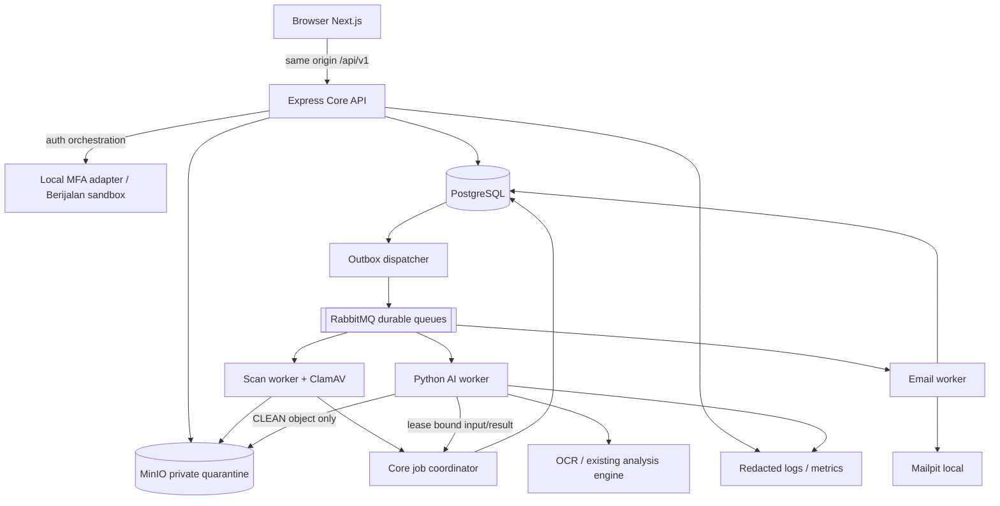

# FinLens — Arsitektur dan Evaluasi Final

Versi 1.0 • Final baseline implementasi lokal • dimulai 5 September, difinalkan 6 September 2026.

Sumber kebenaran: FSD v1.0.0 tanggal 24 Agustus 2026 dan jawaban user/BA; instruksi terbaru user mengatasi catatan sebelumnya. Dokumen lama, repo, dan Figma adalah referensi turunan/teknis, bukan pengganti aturan bisnis. Status final berarti kontrak untuk coding berikutnya; bukan klaim aplikasi sudah dibuat, diuji, atau siap production.

Urutan baca: [ERD](01_ERD.md) → [Spec API](02_SPEC_API.md) → [Task](03_TASK.md) → [Arsitektur dan evaluasi](04_ARSITEKTUR.md). Hanya empat file ini menjadi paket final baru. Dokumen sumber tetap di lokasi semula.
## Acuan dan prioritas

| ID | Acuan | Pemakaian |
|---|---|---|
| S1 | [FSD asli](../../FSD_FinLens%20%2824082026%29.pdf), [ekstraksi FSD](../../FSD_FitLens.md) | Requirement dan field bisnis; Bab 3–14 |
| S2 | [Jawaban BA dan user](../../catatan.txt) | Lifecycle, terminal CHECKED, permission, role dependency, snapshot anomaly, scope |
| S3 | [Keputusan sebelumnya](../../output/discovery/discovery_questions.md), [context](../../project_context.md) | BA-001–BA-024; baseline v0.4 berlaku sampai user mengubahnya |
| S4 | Instruksi user 5 September 2026 di task ini | Empat dokumen final di folder baru; Login siap develop; coding setelah perintah berikutnya |
| R1 | [Repo Python](../../reference/finlens-be), [repo FE prototype](../../reference/finlens-fe) | Referensi logic AI dan integrasi; kontrak prototype tidak diadopsi otomatis |
| R2 | [Express template](../../reference/template%20js/express-js-template-development), [Next.js template](../../reference/template%20js/nextjs-development) | Struktur kerja lokal yang tersedia; repo bernama seva-agency-cms tidak ditemukan di folder |
| R3 | [Figma FinLens](https://www.figma.com/design/HSkVVcOU5xQOgjR5vQ2AUZ/FinLens?node-id=4-45916) | Visual Login siap develop menurut user; readiness modul lain tidak diasumsikan |

S2 memuat material konfigurasi sensitif. Referensikan keputusan bisnisnya saja; jangan menyalin isinya secara utuh ke repository, prompt, log, atau paket distribusi.
## Kesimpulan evaluasi

Gunakan satu monorepo dengan Next.js web, Express/TypeScript core API, PostgreSQL/Prisma, dan Python AI worker yang berjalan terpisah. RabbitMQ + transactional outbox menghubungkan proses asinkron; MinIO/private S3 menyimpan PDF; ClamAV memisahkan quarantine dari dokumen yang boleh dibaca. Ini melanjutkan keputusan BA-020/023/024, bukan mengganti stack yang sudah disepakati.

Paket ini merupakan baseline final untuk **implementasi lokal berikutnya**. Instruksi terbaru user menyatakan coding dimulai setelah perintah berikutnya. Seluruh task masih OPEN; tidak ada migration, application build, SIT, atau provider smoke test yang diklaim telah berjalan.

## Hasil evaluasi sumber dan perbaikan final

| Temuan yang diverifikasi | Dampak | Penyelesaian paket final |
|---|---|---|
| API lama email 254, password 12–256, nama 150/255; FSD email 100/password 8–64/nama 100 | FE dapat mengirim nilai yang ditolak DB atau menyimpang FSD | Field dikembalikan ke batas FSD; anomaly detail 255 |
| Upload API lama tidak mewajibkan documentName dan menerima documentNumber manual | Nama wajib FSD hilang; nomor AI bisa ditimpa user | documentName mandatory, documentNumber read-only dari AI |
| API severityId UUID tetapi ERD severity_code varchar | Tidak ada pemetaan FK yang sah | severityCode CLEAN/LOW/MEDIUM/HIGH/CRITICAL |
| API INACTIVE, ERD NON_ACTIVE; permission dot vs colon | Mapping UI/DB/guard ambigu | NON_ACTIVE dan dot permission konsisten |
| Refresh token di request JSON pada spec, cookie HttpOnly pada context | Frontend tidak dapat mengikuti dua mekanisme sekaligus | Cookie only; typed refresh response, Origin/CORS/SameSite |
| must_change_password ada, tetapi CHANGE_PASSWORD response/endpoint tidak lengkap | Temporary password bisa memperoleh full session atau flow buntu | Context terbatas setelah MFA, endpoint initial-password, single-use digest/credential version |
| Snapshot anomaly hanya disebut di prose, tanpa relasi yang menahan delete job berjalan | Anomaly bisa dihapus sebelum muncul finding | trn_ai_anomaly_snapshot dengan FK dan dependency guard |
| Unique `(tenant_id,normalized_name,deleted_at)` menggunakan NULL untuk row aktif | Duplikat nama aktif tetap bisa tersimpan | Unik tenant+normalized name; nama reserved setelah soft delete |
| FK tunggal memungkinkan id role/category/version milik tenant lain | Tenant leak dan hasil salah pasangan | FK tenant komposit; pointer document/version/analysis diperkuat constraint migration |
| Idempotency, refresh reuse, inbox, email retry hanya prose | Race/crash tidak dapat direkonstruksi | Tabel durable pendukung dan transaksi/lease eksplisit |
| Response banyak endpoint berupa data object bebas | FE tidak memiliki tipe hasil final | DTO resource/list/dashboard/review/session eksplisit dalam OpenAPI |
| Lookup category/role membutuhkan hak melihat halaman master | Submitter atau user administrator terbatas terblokir dropdown | Endpoint options berizin modul pemakai + filter lookup terbatas |
| View anomaly tidak punya GET detail sendiri | Reload/detail bergantung item list yang belum tentu ada | getAnomaly tenant-scoped |
| Review download memakai document.download dalam kontrak umum | Hak History dan Bucket tercampur | review.download pada attachment History; preview lewat review.view |
| Audit lama menyebut 22 task, paket terbaru 49 subitem | Laporan jumlah/coverage tidak dapat dipercaya | 49 kartu bisnis + 4 fondasi + 1 QA dihitung dari paket final |
| Audit Figma 3 September menyebut modul tidak terlihat | Informasi readiness sudah stale | Inventori visual diperbarui dari tab 5 September; Login ready menurut user |
| `reference/template js/express-js-template-development/src/prisma/schemas/schema.prisma`: provider `prostgresql` | Template tidak bisa menjadi schema executable | Perbaiki menjadi postgresql saat implementasi; jangan salin schema begitu saja |
| Template Express package runtime v4 dan @types/express v5 | Tipe/runtime tidak sinkron | Pilih versi kompatibel dan lockfile saat implementasi, jalankan build/typecheck |
| Python api.py memakai PENDING/APPROVED/REJECTED dan require_admin | Bertentangan lifecycle/permission BA | Ambil logic AI saja; Express menjadi pemilik workflow final |
| check_historical_duplicates menerima existing_invoices dari caller | Fungsi engine tidak membuktikan tenant isolation | Core adapter menghasilkan candidate list tenant-scoped sebelum pemanggilan |
| Engine _has_missing_invoice_number memeriksa anomaly, sedangkan FSD meminta nomor hasil ekstraksi | Metrik anomaly dan kelengkapan nomor dapat berbeda | Simpan keduanya; dashboard kelengkapan memakai nomor extraction dan menandai unknown untuk proses belum selesai |

## Ketetapan bisnis yang tidak ditanyakan ulang

| Area | Ketetapan | Sumber |
|---|---|---|
| Otorisasi | Master Role menu/action; Submitter/Checker hanya persona | BA-003, catatan jawaban 3 |
| Dokumen | ANALYZE → OPEN → CHECKED; CHECKED terminal immutable untuk semua actor | BA-001/002 |
| Role | Delete/nonaktif ditolak selagi terpasang pada user, termasuk nonaktif | BA-004 |
| Anomaly | Perubahan hanya untuk job baru; in-flight/history snapshot tetap | BA-005 |
| Responsive | Minimum tablet tanpa functional blocker | BA-006 |
| Excluded | Master Label dan Master Detection Setting | BA-007 |
| MFA | Provider Berijalan, HIGH, maksimal dua hari trust; provider dapat challenge lebih cepat | BA-010 |
| Identity/session | Email global unik immutable; max lima session, keenam revoke tertua; idle 60 menit | BA-013/015 + FSD Bab 3 |
| Password delivery | Generated password via email, single-use, expiry 30 menit, forced change | BA-014 |
| Upload | PDF 20 MiB/100 halaman, reject encrypted, quarantine + ClamAV | BA-016 |
| AI | Existing engine versioned; attempt 15 menit, max tiga, backoff lalu DLQ | BA-017/018 |
| Retention | Soft delete, tidak physical purge pada Phase 1 | BA-019 |
| Development | Seluruh dependency lokal; real provider adapter opsional sandbox; hosted belakangan | BA-022/023/024 |
| UI Login | Siap develop sesuai instruksi user 5 September | S4 |

## Detail teknis yang dilengkapi pada final ini

Berikut adalah keputusan desain analyst untuk membuat baseline yang sudah disetujui dapat diimplementasikan. Ini bukan kutipan jawaban BA baru: cookie refresh sebagai satu mekanisme; context initial-password dan cancellation durable; nama soft-deleted tetap reserved; FK komposit; options endpoints; preview proxy 60 detik; perubahan kategori memicu reanalysis; lease AI dengan fence token; inbox/idempotency; serta klasifikasi nomor unknown sebelum AI selesai. Semua dipilih untuk memenuhi FSD/BA yang sudah ada, dan dicatat terbuka agar perubahan berikutnya dapat dilacak.

FSD 5.3 tenant selector khusus Super Admin ditutup dalam desain final melalui tiga endpoint provisioning terpisah pada `/tenants/{id}`: lookup role target, generate credential draft target, dan create user target. Semua wajib role `platform_managed` serta permission `tenant.view` AND `user.add`. Backend memvalidasi tenant aktif dari path dan mencatat actor home tenant terpisah dari data tenant target. Endpoint user/document biasa tetap scoped ke tenant sesi. Tidak ada perpindahan sesi tenant atau bypass umum. Create tenant menyiapkan role awal Admin Tenant non-platform, tanpa membuat user/password diam-diam; UI Add User kemudian memilih tenant dan role tersebut. Task USR-03 mencakup seluruh alur ini.

## Topologi lokal



Next.js melayani pages dan presentation. Reverse proxy local menyatukan browser origin web/API sehingga refresh cookie dan file proxy tidak memerlukan token di URL halaman. Next.js tidak menjalankan business DB query sendiri. Layanan inti tidak dipecah menjadi banyak microservice; worker dipisah karena runtime dan durasi prosesnya berbeda.

## Struktur repository saat coding

```text
implementation/finlens/
  apps/
    web/src/
      app/                      Next.js App Router pages/layout
      components/atoms/          button, input, badge, spinner
      components/molecules/      form field, filter row, confirmation dialog
      components/organisms/      data table, auth form, PDF review, permission grid
      features/                 auth, tenants, users, roles, anomalies,
                                file-categories, documents, reviews, audit,
                                dashboard, notifications, profile
      services/                 API client, query keys, mutations
    api/src/
      modules/                  same domain boundaries
      middleware/               session, tenant, permission, validation, errors
      integrations/             mfa, email, storage, scanner, broker
      jobs/                     outbox, scan, result ingestion, notification
  packages/
    contracts/                  extracted OpenAPI + generated TypeScript DTO
    db/prisma/                  schema, SQL migrations, seed
  workers/ai/
    engine/                     extracted reusable reference Python logic
    adapters/                   OCR, snapshot evaluation, scoped candidates
    consumer/                   lease, timeout, retry, result transport
  infra/                        compose, env examples, local run commands
  tests/                        contract, integration, E2E, AI regression fixtures
```

Belum ada folder aplikasi yang dibuat pada pekerjaan dokumentasi ini. Folder `reference/` tetap diperlakukan sebagai sumber baca. Tidak ada file private key, SQLite database, uploads atau .env reference yang disalin sebagai seed/config baru.

## Kepemilikan data dan proses

| Komponen | Memiliki | Tidak boleh melewati |
|---|---|---|
| Express modules | Semua authorization, master CRUD, sessions, document state, review, audit, projection dashboard | Tenant+permission+version+state guard |
| Prisma + SQL migration | Satu schema PostgreSQL, FK/check/trigger/seed | Python tidak menjalankan competing migrations |
| Core coordinator | Job state, leases, snapshot, acceptance hasil dan transaksi OPEN | Fence token/current input check |
| Python worker | OCR, deterministic/LLM analysis, tamper, similarity | Tidak mengotorisasi user atau finalize CHECKED |
| Object adapter | Immutable private version bytes, checksum, scan flags | Tidak public bucket dan tidak memberi AI objek PENDING |
| Email worker | Kirim onboarding/reset mail, metadata delivery/retry | Tidak plaintext credential dalam queue/DB/log |
| Notification consumer | Event→recipient projection | Tenant+user recipient, recheck permissions |

Audit, outbox dan mutation berhasil berada dalam transaksi PostgreSQL yang sama. Object store dan SMTP tidak bisa menjadi bagian atomic DB transaction; compensating state/retry di bawah wajib, jangan mengklaim distributed exactly-once.

## Protokol job internal

Protokol ini bukan endpoint untuk browser. Transport final: RabbitMQ membawa identifier; core coordinator menyediakan internal HTTP di listener private terpisah untuk lease/input/result. Adapter memakai service identity dan lease secret, TLS di hosted environment; local identity dummy ditandai development-only. Internal listener tidak diproxy ke public `/api/v1`.

| Internal command | Request | Success | Reject |
|---|---|---|---|
| POST /internal/v1/analyses/{id}/claim | eventId, workerId | leaseToken, leaseExpiresAt, attempt, tenantId, inputManifest | 409 jika completed/lease masih aktif; 404 unknown job |
| GET /internal/v1/analyses/{id}/input | service auth + leaseToken | versionId, checksum, short-lived CLEAN object access, snapshots, candidate manifests | 401 invalid service, 409 expired/fenced lease |
| POST /internal/v1/analyses/{id}/result | leaseToken, resultEventId, inputHash, result envelope | 204 accepted atau duplicate hasil identik | 409 stale lease/input/version/result berbeda; 422 schema invalid |
| POST /internal/v1/analyses/{id}/failure | leaseToken, failureCode, retriable | 204 + next QUEUED/FAILED state | 409 stale lease |

```json
{
  "eventId": "00000000-0000-4000-8000-000000000001",
  "eventType": "analysis.requested.v1",
  "tenantId": "00000000-0000-4000-8000-000000000002",
  "analysisId": "00000000-0000-4000-8000-000000000003",
  "documentId": "00000000-0000-4000-8000-000000000004",
  "documentVersionId": "00000000-0000-4000-8000-000000000005",
  "configurationHash": "sha256-of-canonical-snapshot",
  "occurredAt": "2026-09-05T03:00:00Z"
}
```

Result envelope membawa enginePolicyVersion/modelVersion/promptVersion/ruleVersion/similarityPolicyVersion, documentInfo.invoiceNumber nullable, fraudScore 0–100, severityCode, extractedData, findings[], similarities[] dengan matchedDocumentId/matchedVersionId/matchType/optional score/rank/signals/explanation. Bentuk public subset merujuk AnalysisSummary/Finding/Similarity di Spec API. Result service memvalidasi semua ID kandidat adalah anggota snapshot tenant job, anomalyId berasal dari snapshot, page/score bounds valid, hash/version cocok, dan job lease belum fenced.

Input snapshot kanonis mencakup category ID/name/version; setiap anomaly ID/detail/severity/version aktif; candidate document/version/analysis IDs dan checksum; serta engine/prompt/rule versions. Hash SHA-256 atas serialisasi stabil; jangan hanya menyimpan nama policy tanpa konten konfigurasi. Engine worker boleh menyimpan raw result terbatasi sebagai evidence, tetapi public DTO tidak mengembalikan kredensial/provider traces/raw OCR berlebihan.

### Failure, retry dan konsistensi

1. Upload menulis object quarantine dahulu, kemudian transaksi metadata/version/job/snapshot/outbox. Gagal transaksi tidak menerbitkan job; orphan quarantine dicatat operasional dan tetap private. Tidak menjalankan auto physical purge Phase 1.
2. Scan PENDING punya worker lease dan recovery setelah crash. INFECTED langsung terminal. ERROR scanner diulang maksimal tiga kali dengan 30/120 detik; setelah itu FAILED/SCAN_UNAVAILABLE. AI attempts belum dihitung sebelum CLEAN.
3. Dispatcher membaca outbox dengan SKIP LOCKED, publish persistent message ke durable queue, tunggu publisher confirm, baru tandai published_at. Crash sesudah broker confirm sebelum DB update dapat duplicate; inbox menutup duplicate logical side effect.
4. Claim AI menaikkan attempt_count atomik (maksimal 3), mengeluarkan random lease token yang hanya digest-nya disimpan dan deadline absolut 15 menit. Tidak ada extend melewati 15 menit. Coordinator sweeper mem-fence timeout dan merencanakan retry 30 lalu 120 detik; setelah ketiga FAILED dan DLQ event.
5. Worker terisolasi per attempt dapat dihentikan saat timeout. Hasil lambat setelah fencing ditolak, meskipun worker masih berjalan. Consumer tidak ACK sebelum claim durable atau terminal/duplicate resolution.
6. Hasil sukses menulis analysis/findings/similarities, update document OPEN dan audit/outbox dalam satu transaksi. Result duplicate identik 204 tanpa efek ulang; duplicate ID dengan hash berbeda 409. Candidate comparison memakai versi historis persis, bukan current file terbaru kandidat.
7. Semua lookup byte file melewati proxy dengan autentikasi ulang; object signed URL internal tidak diekspos ke halaman. Inactive/deleted candidate tidak bisa dibuka meskipun match historis disimpan. History default tidak menampilkan inactive/deleted dokumen.
8. Ops replay DLQ merupakan command terkontrol di tool operator lokal, diaudit dan tetap tenant scoped. Replay membuat run baru hanya jika dokumen masih ANALYZE/FAILED dan bukan CHECKED; tidak ada tombol retry client.
9. Email at-least-once: simpan intent+template+recipient/credential version metadata, tanpa plaintext. Kirim rahasia dari memory. Bila proses crash/hasil SMTP ambigu, regenerasi credential/token baru, invalidasi sebelumnya dan kirim email baru. Retry max tiga, backoff 30/120 detik, lalu FAILED. UI status delivery dan admin reset memakai endpoint existing; hanya email terbaru valid. reset-request selalu netral agar tidak bocor akun.
10. Notification event uploaded → active review.view recipients; analysis completed/failed → uploader + active review.view; checked → uploader. Deduplicate union recipients. Tidak memakai nama Checker. Mark-read tidak mengubah state user lain, dan notification tidak menjadi izin membaca dokumen.

## Reuse reference secara terarah

- `reference/finlens-be/fraud_analyzer.py`: reuse fungsi analyze_fraud, check_historical_duplicates, extract_doc_info_from_ocr dan deterministic checks setelah parameterisasi repository/few-shot sources. Fungsi few-shot yang membaca histori wajib mendapat scope tenant yang sama, bukan hanya fungsi similarity.
- `reference/finlens-be/api.py`: ekstrak score normalization _determine_status tanpa nilai business status PENDING-nya. Rules score >=81 CRITICAL, >=61 HIGH, >=41 MEDIUM, >=21 LOW, selain itu CLEAN tetap mengikuti engine; special minimum rules existing tetap diuji fixture. Jangan copy approve/reject routes atau require_admin guards.
- `ai_ocr_json.py` dan `tamper_detector.py`: reuse OCR/tamper adapters setelah mengganti credentials/file-path globals dengan config/immutable input. Live OCR/LLM harus diuji terpisah dari deterministic fixtures.
- Template Express: ambil env/config/middleware dan TypeScript conventions; perbaiki datasource typo, pasangkan runtime/type versions, ganti placeholder routers dan error envelope. Hindari service/controller tunggal berisi seluruh domain.
- Template Next.js: gunakan App Router, atomic reusable components, services/query/mutation pattern. Login template hanya logo/header generik, bukan implementasi UI Login FinLens. FE prototype memiliki route/domain berguna untuk referensi; authorization dan response wajib mengikuti final spec.
- Dependency exact versions dipilih dan diverifikasi dari official release/package metadata ketika coding, lalu lockfile dikomit pada repo implementasi. Dokumen ini tidak menyatakan seluruh versi package reference aman atau kompatibel, karena install/build/audit belum dijalankan.

## Status desain Figma

Inspeksi tab Figma 5 September menunjukkan Page 1 dengan layer Login, Dashboard, Search & Filter All Master, Master Tenant, Master User, Master Role, Master Anomaly, Master File Category, Submit Document, Bucket Document, Activity Log User, Notification, Setting Profile, Logout, komparasi-invoice, dan komponen badge/filter/toast. Ini mengoreksi inventori lama yang menyebut sebagian modul tidak terlihat.

Login memiliki status **siap develop menurut user**. Inspeksi sesi guest tidak memberi Dev Mode properties/version snapshot yang cukup untuk mengklaim seluruh spacing/tokens/state Login telah diverifikasi pixel-level; visual QA dilakukan ketika coding. Kehadiran layer bukan bukti status Ready for Dev modul lain. Ikuti Figma untuk visual, FSD+BA untuk permission, validation dan lifecycle; jika Figma masih menampilkan OPEN segera setelah upload atau hapus permanen, gunakan aturan BA terbaru.

## Pengujian yang harus menjadi bukti implementasi

| Lapisan | Bukti minimal saat coding |
|---|---|
| Schema | Migration reset/seed, unique/FK tenant guards, deferrable document pointers, trigger CHECKED/audit immutable |
| API | Request/response schema check, permission matrix, lookup least privilege, invalid/stale IDs, origin/cookie behavior |
| Auth | Temporary login→MFA→forced change, sixth concurrent session, idle 60m, refresh reuse, inactive user/tenant, provider failure |
| Upload | PDF 20 MiB/100 pages boundary, MIME spoof, encrypted, ClamAV infected/unavailable, crash-safe idempotency |
| AI | Engine regression fixtures, active-only anomaly snapshot effect, category policy effect, tenant-safe historical/few-shot selection, late result fencing |
| Review | Concurrent replace/finalize, stale analysis, duplicate finalize, same-tenant candidate relation, all CHECKED mutations rejected |
| Projection | Dashboard denominators/snapshot/date filter, duplicate event notification, per-recipient read state |
| FE | Login Figma comparison, permission/empty/loading/error/conflict states, keyboard/focus, desktop/tablet, no credential persistence |

SIT lama dapat menjadi inspirasi skenario, tetapi status Not Run tetap Not Run. Jangan memakai laporan consistency lama sebagai hasil test aplikasi. Validasi dokumentasi final adalah pemeriksaan struktur/reference/coverage; belum membuktikan DDL berhasil dieksekusi atau engine memenuhi behavior baru.

## Yang ditunda dan batas final

Manual account unlock, user-facing AI retry, audit export, reopen/correction CHECKED, dan physical purge tidak masuk implementasi Phase 1 baseline. Staging/production/domain/CI-CD hosted, production MFA credentials, capacity/RTO/RPO/backup dan retention/legal hold tetap pekerjaan sebelum hosted release, bukan blocker membuat fitur lokal.

Batas verifikasi: penerapan dinamis anomaly/category ke engine perlu dibuktikan melalui adapter dan regression fixtures; exact Figma properties serta real MFA package distribution belum diverifikasi pada pekerjaan dokumen ini. Tenant selector sudah memiliki desain/endpoint/task yang konsisten. Dokumen final mengunci keputusan yang tersedia, sementara hasil runtime baru dapat dibuktikan saat coding.

## Perintah coding berikutnya

```text
Mulai implementasi FinLens dari final/FinLens_Phase1_2026-09-05.
Kerjakan FND-01 sampai FND-04, lalu task bisnis sesuai dependency pada 03_TASK.md.
Buat monorepo baru di implementation/finlens; gunakan reference sebagai acuan baca.
FSD dan jawaban BA/user tetap sumber kebenaran. Gunakan UI Login Figma yang sudah siap develop.
Jalankan dan laporkan bukti test tiap alur; lanjutkan lokal sampai task yang sudah fix selesai.
Jangan menyebut integration mock sebagai real provider atau melakukan deployment production.
```


## Traceability seluruh functional requirement

ID FR dipertahankan dari katalog analisis lama; FSD sendiri tidak mempunyai ID FR. Coverage di bawah menunjukkan pemetaan kontrak/task, bukan bukti hasil implementasi.

| FR | FSD Bab | Requirement | Task final |
|---|---|---|---|
| FR-001 | 3.2-3.4 | Validate active email/password before MFA | [LGN-01](03_TASK.md#lgn-01) |
| FR-002 | 3.2-3.4 | Enroll and verify 6-digit TOTP through MFA Provider Service | [LGN-03](03_TASK.md#lgn-03) |
| FR-003 | 3.3 | Lock login after 3 consecutive password failures for 3 hours | [LGN-01](03_TASK.md#lgn-01) |
| FR-004 | 3.2-3.5 | Issue single-use password-reset token expiring after 30 minutes | [LGN-02](03_TASK.md#lgn-02) |
| FR-005 | 3.3 | End idle sessions after 60 minutes and allow at most five durable sessions per user | [LGN-01](03_TASK.md#lgn-01), [LGN-03](03_TASK.md#lgn-03), [PRO-03](03_TASK.md#pro-03) |
| FR-006 | 3.3 and all modules | Derive `tenant_id` from authenticated context and scope every query | [USR-01](03_TASK.md#usr-01), [USR-02](03_TASK.md#usr-02), [USR-04](03_TASK.md#usr-04), [ROL-01](03_TASK.md#rol-01), [ROL-02](03_TASK.md#rol-02), [ANO-01](03_TASK.md#ano-01), [ANO-02](03_TASK.md#ano-02), [KAT-01](03_TASK.md#kat-01), [KAT-02](03_TASK.md#kat-02), [SUB-03](03_TASK.md#sub-03), [BUC-01](03_TASK.md#buc-01), [BUC-02](03_TASK.md#buc-02), [REV-01](03_TASK.md#rev-01), [LOG-01](03_TASK.md#log-01), [LOG-02](03_TASK.md#log-02), [DSH-01](03_TASK.md#dsh-01), [DSH-02](03_TASK.md#dsh-02), [DSH-03](03_TASK.md#dsh-03), [NOT-01](03_TASK.md#not-01) |
| FR-007 | 6 | Authorize menu/action access through role-permission matrix | [ROL-01](03_TASK.md#rol-01), [ROL-02](03_TASK.md#rol-02), [ROL-03](03_TASK.md#rol-03), [ROL-04](03_TASK.md#rol-04), [ANO-01](03_TASK.md#ano-01), [KAT-01](03_TASK.md#kat-01), [BUC-01](03_TASK.md#buc-01), [REV-01](03_TASK.md#rev-01), [LOG-01](03_TASK.md#log-01) |
| FR-008 | 4.2-4.4 | Super User can list/search/page/view/create/update tenants | [TEN-01](03_TASK.md#ten-01), [TEN-02](03_TASK.md#ten-02), [TEN-03](03_TASK.md#ten-03), [TEN-04](03_TASK.md#ten-04), [USR-03](03_TASK.md#usr-03) |
| FR-009 | 4.2-4.4 | Super User can activate/deactivate tenant | [TEN-05](03_TASK.md#ten-05) |
| FR-010 | 5.2-5.4 | Admin can list/search/page/view/create/update tenant users | [USR-01](03_TASK.md#usr-01), [USR-02](03_TASK.md#usr-02), [USR-03](03_TASK.md#usr-03), [USR-04](03_TASK.md#usr-04) |
| FR-011 | 5.2-5.4 | System emails a generated temporary onboarding/reset password | [LGN-01](03_TASK.md#lgn-01), [USR-03](03_TASK.md#usr-03), [USR-05](03_TASK.md#usr-05) |
| FR-012 | 5.3-5.4 | Admin can activate/deactivate user and optionally reset credential | [USR-05](03_TASK.md#usr-05) |
| FR-013 | 6.2-6.4 | Admin can CRUD tenant roles with case-insensitive unique name | [USR-03](03_TASK.md#usr-03), [USR-04](03_TASK.md#usr-04), [ROL-01](03_TASK.md#rol-01), [ROL-02](03_TASK.md#rol-02), [ROL-03](03_TASK.md#rol-03), [ROL-04](03_TASK.md#rol-04), [ROL-05](03_TASK.md#rol-05) |
| FR-014 | 6.2-6.4 | Admin can assign Add/Edit/Delete/View/Download/All permissions per menu | [ROL-02](03_TASK.md#rol-02), [ROL-03](03_TASK.md#rol-03), [ROL-04](03_TASK.md#rol-04) |
| FR-015 | 6.3-6.4 | Role cannot be deleted or deactivated while assigned to any user, including inactive users | [ROL-05](03_TASK.md#rol-05) |
| FR-016 | 7.1-7.4 | Admin can CRUD and activate/deactivate anomaly definitions | [ANO-01](03_TASK.md#ano-01), [ANO-02](03_TASK.md#ano-02), [ANO-03](03_TASK.md#ano-03), [ANO-04](03_TASK.md#ano-04), [ANO-05](03_TASK.md#ano-05) |
| FR-017 | 7.1-7.4 | Anomaly maps to Clean/Low/Medium/High/Critical | [ANO-01](03_TASK.md#ano-01), [ANO-03](03_TASK.md#ano-03), [ANO-04](03_TASK.md#ano-04), [ANO-05](03_TASK.md#ano-05) |
| FR-018 | 7.3-7.4 | Anomaly cannot be deleted while referenced by an active or historical AI analysis | [ANO-05](03_TASK.md#ano-05) |
| FR-019 | 8.1-8.4 | Admin can CRUD and activate/deactivate document categories | [KAT-01](03_TASK.md#kat-01), [KAT-02](03_TASK.md#kat-02), [KAT-03](03_TASK.md#kat-03), [KAT-04](03_TASK.md#kat-04), [KAT-05](03_TASK.md#kat-05) |
| FR-020 | 8.3-8.4 | Only active categories appear in upload forms | [KAT-01](03_TASK.md#kat-01), [KAT-05](03_TASK.md#kat-05), [SUB-01](03_TASK.md#sub-01) |
| FR-021 | 8.3-8.4 | Category cannot be deleted while referenced by documents | [KAT-05](03_TASK.md#kat-05) |
| FR-022 | 9.1-9.4 | User with Bucket view permission can list/search/filter/page tenant documents | [ROL-01](03_TASK.md#rol-01), [ANO-01](03_TASK.md#ano-01), [KAT-01](03_TASK.md#kat-01), [SUB-03](03_TASK.md#sub-03), [BUC-01](03_TASK.md#buc-01), [BUC-02](03_TASK.md#buc-02), [REV-01](03_TASK.md#rev-01), [LOG-01](03_TASK.md#log-01) |
| FR-023 | 9.2-9.4 | User with Bucket add permission can upload a uniquely named PDF with active category, maximum 20 MB and 100 pages | [SUB-01](03_TASK.md#sub-01), [SUB-02](03_TASK.md#sub-02), [BUC-03](03_TASK.md#buc-03) |
| FR-024 | 9.2-9.4 | A clean upload creates an asynchronous AI job using the existing Python engine in the same monorepo | [SUB-02](03_TASK.md#sub-02), [BUC-03](03_TASK.md#buc-03) |
| FR-025 | 9.2-9.4 | User with the relevant Bucket permission can replace/update/toggle/soft-delete only while OPEN | [SUB-03](03_TASK.md#sub-03), [BUC-02](03_TASK.md#buc-02), [BUC-03](03_TASK.md#buc-03), [BUC-04](03_TASK.md#buc-04) |
| FR-026 | 9.1-9.4 | CHECKED document is permanently immutable for every actor | [BUC-03](03_TASK.md#buc-03), [BUC-04](03_TASK.md#buc-04), [REV-04](03_TASK.md#rev-04) |
| FR-027 | 10.1-10.4 | User with History view permission can filter and view tenant document history | [ROL-01](03_TASK.md#rol-01), [ANO-01](03_TASK.md#ano-01), [KAT-01](03_TASK.md#kat-01), [BUC-01](03_TASK.md#buc-01), [BUC-02](03_TASK.md#buc-02), [REV-01](03_TASK.md#rev-01), [REV-02](03_TASK.md#rev-02), [REV-03](03_TASK.md#rev-03), [LOG-01](03_TASK.md#log-01) |
| FR-028 | 10.1-10.4 | User with History comparison permission can view tenant-scoped similarity recommendations and compare documents | [BUC-02](03_TASK.md#buc-02), [REV-02](03_TASK.md#rev-02), [REV-03](03_TASK.md#rev-03) |
| FR-029 | 10.2-10.4 | User with finalize permission can transition OPEN document to CHECKED once | [REV-04](03_TASK.md#rev-04) |
| FR-030 | 4-14 | Every material command emits structured audit event | [LOG-01](03_TASK.md#log-01), [LOG-02](03_TASK.md#log-02) |
| FR-031 | 11.1-11.4 | Authorized user can filter/page/view audit logs read-only | [ROL-01](03_TASK.md#rol-01), [ANO-01](03_TASK.md#ano-01), [KAT-01](03_TASK.md#kat-01), [BUC-01](03_TASK.md#buc-01), [REV-01](03_TASK.md#rev-01), [LOG-01](03_TASK.md#log-01), [LOG-02](03_TASK.md#log-02) |
| FR-032 | 12.1-12.4 | Dashboard shows total/OPEN/CHECKED counts and percentages | [DSH-01](03_TASK.md#dsh-01), [DSH-02](03_TASK.md#dsh-02), [DSH-03](03_TASK.md#dsh-03) |
| FR-033 | 12.1-12.4 | Dashboard shows severity distribution | [DSH-01](03_TASK.md#dsh-01), [DSH-02](03_TASK.md#dsh-02), [DSH-03](03_TASK.md#dsh-03) |
| FR-034 | 12.1-12.4 | Dashboard shows document-number completeness and missing-number list | [DSH-01](03_TASK.md#dsh-01), [DSH-02](03_TASK.md#dsh-02), [DSH-03](03_TASK.md#dsh-03) |
| FR-035 | 12.2-12.4 | User can refresh dashboard without full page reload | [DSH-01](03_TASK.md#dsh-01), [DSH-02](03_TASK.md#dsh-02), [DSH-03](03_TASK.md#dsh-03) |
| FR-036 | 13.1-13.4 | Approved document events create tenant-scoped UNREAD notifications for users selected by effective permissions | [NOT-01](03_TASK.md#not-01) |
| FR-037 | 13.2-13.4 | User can filter notifications and mark one/all as READ | [NOT-01](03_TASK.md#not-01), [NOT-02](03_TASK.md#not-02) |
| FR-038 | 13.2-13.4 | Clicking a notification marks it READ and opens document review | [NOT-02](03_TASK.md#not-02) |
| FR-039 | 14.1-14.4 | User can update own profile name but not email | [PRO-01](03_TASK.md#pro-01) |
| FR-040 | 14.1-14.4 | User can change password after old-password and complexity checks | [PRO-02](03_TASK.md#pro-02) |
| FR-041 | 14.1-14.4 | User can list and revoke other active device sessions | [PRO-03](03_TASK.md#pro-03) |
| FR-042 | 4-14 | Lists support deterministic sorting, pagination, empty/loading/error states | [TEN-01](03_TASK.md#ten-01), [USR-01](03_TASK.md#usr-01), [ROL-01](03_TASK.md#rol-01), [ANO-01](03_TASK.md#ano-01), [KAT-01](03_TASK.md#kat-01), [BUC-01](03_TASK.md#buc-01), [REV-01](03_TASK.md#rev-01), [LOG-01](03_TASK.md#log-01), [NOT-01](03_TASK.md#not-01) |
| FR-043 | 7-10 | AI results preserve `engine-policy-v1`, model/rule version, extraction payload, fraud score/level, findings, evidence, and similarity algorithm version | [REV-02](03_TASK.md#rev-02) |
| FR-044 | 9-10 | PDF retrieval uses short-lived authorization, not public URLs | [BUC-02](03_TASK.md#buc-02), [BUC-04](03_TASK.md#buc-04), [REV-02](03_TASK.md#rev-02), [REV-03](03_TASK.md#rev-03) |
| FR-045 | 11 | Audit records are append-only and retained without physical purge in Phase 1 | [LOG-01](03_TASK.md#log-01), [LOG-02](03_TASK.md#log-02) |


## Pemeriksaan paket final — 6 September 2026

Pemeriksaan skrip lokal `scratch/validate_final.py` lulus: reference internal OpenAPI, parameter path, scheme auth, JSON fences, contoh request/response terhadap subset aturan schema, relasi DBML dan target unik komposit, tautan file/anchor, coverage requirement/operasi dan dependency tanpa cycle. Ini structural validation; bukan sertifikasi penuh parser OpenAPI/DBML atau hasil test aplikasi.

| Ukuran | Hasil |
|---|---:|
| tables | 26 |
| relationships | 59 |
| paths | 58 |
| operations | 75 |
| functional_requirements | 45 |
| business_tasks | 49 |
| execution_units | 54 |
| examples_checked | 96 |

File sumber FSD Markdown SHA-256: `0a7f0d4d5599231ddbc02dd61aa531b146ee1f89ce0fc9b042546f01b8b99512`.
